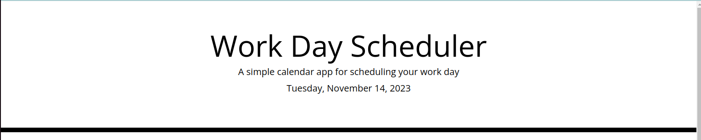
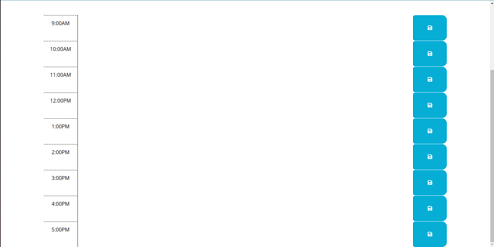
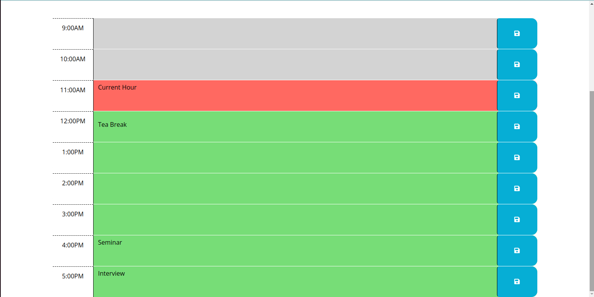

# Workday Planner

## Overview

This is a calendar application that allows a user to save events for each hour of the
day in order to keep track of daily routine.

## Website visuals

The following images show the web application's appearance and functionality:

## Technologies

- HTML
- CSS
- Bootstrap
- jQuery
- Javascript

## Website

https://github.com/ahmadsaqib1/workday_planner

## Contributions

Made by Ahmad Saqib
